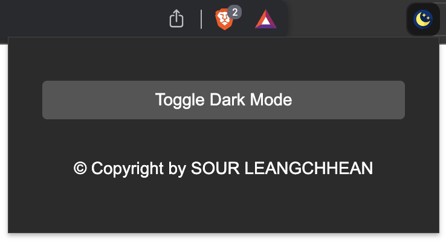

# Dark Mode Chrome Extension

Enable dark mode on any webpage with this Chrome extension!

## Features

- Toggle dark mode on and off easily.
- Applies dark mode styles to most websites.
- Simple and lightweight.

## Installation

### Chrome Web Store

You can install the extension directly from the [Chrome Web Store](https://chromewebstore.google.com/detail/dark-mode-extension/eclmbghonmpmidmdinmeamidmcefnlab).

### Manual Installation

1. Clone this repository or download the latest release.
2. Open Chrome and go to `chrome://extensions/`.
3. Enable **Developer mode**.
4. Click on **Load unpacked** and select the extension directory.

## Usage

Once installed, click on the extension icon in your Chrome toolbar to toggle dark mode on or off for the current webpage.

## Screenshots

*Dark Mode Enabled on Example Website*

## Contributing

Contributions are welcome! Here's how you can contribute:

1. Fork the repository.
2. Create a new branch (`git checkout -b feature/awesome-feature`).
3. Make your changes.
4. Commit your changes (`git commit -am 'Add awesome feature'`).
5. Push to the branch (`git push origin feature/awesome-feature`).
6. Create a new Pull Request.

Please make sure to update tests as appropriate and adhere to the [Code of Conduct](CODE_OF_CONDUCT.md).

## License

This project is licensed under the MIT License - see the [LICENSE](LICENSE) file for details.

## Acknowledgments

- Thanks to [Author Name] for inspiration and guidance.
- Icons made by [Icon Author](https://www.flaticon.com/free-icons/dark-mode) from [Dark mode icons created by Freepik - Flaticon]([https://www.flaticon.com](https://www.flaticon.com/free-icons/dark-mode)).

---

### Disclaimer

This project is not affiliated with or endorsed by Chrome, Google, or any related project.

